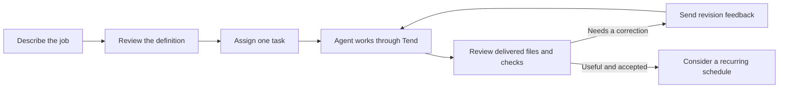

# Bench Hire

**Give a digital worker a job, review its first result, and help it get better.**

Hire is a local web interface for the Bench tools. Describe an ongoing
responsibility, review the proposed job description, and assign one concrete
task. The worker's page brings together its deliverables, feedback, skills,
files, and routines, so you can understand the work without reading a process log.

Underneath, each worker is an [Agent](https://github.com/patrickyoung/agent)
home. [Tend](https://github.com/patrickyoung/tend) runs its tasks durably;
Ply and Ask do the model work; executable checks record what passed. Your
acceptance of a delivered result remains a separate, visible decision.

[Install](#install) · [First useful result](#get-your-first-useful-result) ·
[Improve a worker](#help-the-worker-improve) · [Connected apps](#connect-apps-and-teach-a-workflow)

## Install

You need **Go 1.26+**, Git, and the
[Bench suite](https://github.com/patrickyoung/bench#install). Install the suite
first, then clone Hire's current `main`:

```sh
git clone https://github.com/patrickyoung/bench-hire.git
cd bench-hire
go build -o hire .
export PATH="$HOME/.local/bin:$PATH"
```

Configure a model supported by the installed Ask. For an API-key provider,
replace these placeholders in the shell that will launch Hire:

```sh
export HIRE_MODEL='anthropic/YOUR_MODEL_ID'
export ANTHROPIC_API_KEY='YOUR_API_KEY'
./hire
```

Open **[http://127.0.0.1:8790](http://127.0.0.1:8790)**. Keep that terminal
running while you use the application. Stop with Ctrl+C; restart from the same
location to use the same data. Model-backed work uses your provider account.

Build a stable executable as shown. Tend records Hire's executable path in
jobs, so a temporary `go run` binary is unsuitable for work that must survive
restart.

On Linux, install Bubblewrap and run `cage check`; on macOS, Cage uses the
system Seatbelt backend. Worker app calls currently require Linux, although
ordinary local worker tasks and review have a separate platform boundary.

### Using a ChatGPT/Codex login

For `openai-codex/YOUR_MODEL_ID`, Hire's Ask wrapper can read the official
Codex CLI login from `~/.codex/auth.json` or `$CODEX_HOME/auth.json`. Log in
with `codex login` first. Hire does not change the CLI's login file; it keeps
its refreshed copy privately under the data directory and passes the header
to Ask on descriptor 3.

Alternatively, set `HIRE_OAUTH_PROFILE=NAME` for a configured
[OAuth](https://github.com/patrickyoung/oauth) profile. Hire then uses
`oauth with` instead of consulting the CLI login. See
[BENCH_TOOLS.md](BENCH_TOOLS.md) for the selected suite and compatibility details.

## Get your first useful result

Start with a small supplied example, so you can see the inputs and what its
check actually covers:

1. Open **Hire → Start with an example**. Choose the sales reporter, document
   action clerk, or software maintenance worker.
2. Read the job description and check, then hire the worker. Hiring creates
   the worker; it does not silently start the first task.
3. Load the supplied first task in **Tasks**, inspect its inputs, and choose
   **Assign task**. Leave optional AI task splitting off for the first run.
4. Open the result from **Inbox** or the worker's task list. Read the document,
   inspect its delivery files, and compare it with the requested outcome.
5. Accept the result if it meets your needs, or choose **Request revision**
   with specific feedback. The original result remains available.

The [example guide](examples/README.md) explains each fixture and its check.
These examples demonstrate a bounded task, not general worker quality.

For your own first worker, a useful description is:

> Read the weekly sales CSV I provide. Summarize totals and changes, name the
> source file, and flag missing values. Write a report for me to review; do not
> contact anyone or change the source data.

Then assign a specific file and a specific reporting period. The standing
job supplies the method; each task supplies the immediate request and inputs.



## Find the next thing you need

| Destination | Use it to… |
| --- | --- |
| Team | See workers and counts of running work, schedules, and inbox items |
| Inbox | Review results and tasks needing a decision |
| Tasks | Assign work, inspect attempts, accept results, and request revisions |
| Job description | Review or edit the standing responsibility |
| Training | Manage skills, memory, specialists, and reviewed learning |
| Files | Inspect deliverables and reuse references from the Source library |
| Schedule | Add, edit, pause, or run recurring instructions |
| Tools & access | Inspect programs, model/network choices, app grants, and external actions |

Technical evidence remains available under labelled details. A completed
process is not automatically an accepted deliverable. Results retain the job
description, checks, and inputs used by that run; today's edits do not rewrite
what an earlier task was judged against.

## Bring your own materials

Attach files to tasks, feedback, recurring instructions, job conversations,
skills, or memory. Saved sources can be attached again from the Source library.

| Input | How it becomes readable |
| --- | --- |
| Text, Markdown, CSV, other UTF-8 | Retained as text |
| DOCX, XLSX, PPTX | Local text/cell extraction; layout, images, charts, and macros are not interpreted |
| PNG, JPEG, GIF, WebP, PDF | A bounded Ask attachment call using a model that supports the media |

Limits include 16 files per assignment, 16 MiB per file, and 2 MiB readable
text per source. AI extraction can be uncertain. For image-based Office files,
export a PDF when visual interpretation is required.

Source records are normalized through Context and retained with content
identities. Cite validates source-link identities; it does not establish that
a claim is true. Use **Check delivery citations** to inspect that part of a
task's evidence separately from its completion check.

Attaching a reference does not install a skill or save a memory. Source
interpretation actions create editable drafts—such as **Suggest memories** or
**Draft skill from sources**—which you review and explicitly use/save.
Inferred memories begin unselected. Previous drafts remain inspectable.

## Help the worker improve

Begin with the smallest change that addresses what you observed:

| What you learned | Useful next step |
| --- | --- |
| This result needs correction | Request a revision, or save feedback without starting work |
| The standing job is unclear | Review a job-description proposal or edit the definition |
| The worker needs a repeatable method | Add a reviewed skill, optionally drafted from sources |
| An existing skill needs better instructions/resources | Use **Improve skill**, compare versions, and run its proposed checks |
| A run failed and then passed its verifier | Inspect Hone evidence and prepare an exact lesson proposal |
| A separate perspective would help | Create a specialist home and assign a bounded task |

Skill improvements cover the whole folder, including instructions, scripts,
references, and assets. The installed version stays unchanged while you review.
Checks run on fresh copies of both versions under Cage, with networking off.
Passing establishes those checks, not general quality. Editing the proposal
invalidates its earlier results. Apply installs the exact reviewed version;
prior contents remain available to restore.

Hone learning is a different path: it requires a verified recovery, prepares
exact bytes, and admits them only after review. A successful task can still
teach nothing useful. Hire does not automatically accumulate lessons or rewrite
memory just because more work finished.

Specialists have separate goals, checks, working directories, and history.
They appear in the parent's task flow but do not inherit its conversation,
skills, or app grants. Their accepted results do not count as acceptance of the
parent's work; use the findings as explicit input to a later task.

## Turn a reviewed task into a routine

Use **Schedule** after a representative task has produced a useful result.
Choose instructions, cadence, and start time in the displayed timezone.
Each occurrence creates a task whose output you can review.

Pausing a worker stops new tasks and schedule admission; already queued work
can still run. Retirement disables schedules and cancels pending jobs. Active
work may finish, and uncertain attempts need explicit resolution. Retired
workers keep readable results and history.

A restarted controller never silently repeats an outcome marked unknown.
Inspect the external state before choosing a resolution that could repeat an
effect. A conversation checkpoint preserves context; it does not make a retry
safe by itself.

## Connect apps and teach a workflow

In **Settings → Connected apps**, or **Tools & access → Manage apps & skills**:

1. **Connect.** Supply a service's MCP URL/program or configuration and its
   required authentication. OAuth owns supported login and refresh.
2. **Give access.** Review discovered capabilities and choose each employee's
   grants: automatic use, prepare for approval, or a particular resource read.
3. **Teach.** Draft a skill using those permitted capabilities and your
   materials. Review it before installation.

Discovery and a server's read-only hint do not authorize automatic use.
Teaching cannot expand access. Protocol selection is explicit: `mcp` for the
stateless protocol, `mcp-legacy` for earlier services. These workflows need the
selected suite's MCP tools, Action, Ask, Context, Cite, and relevant OAuth/May
support.

Worker app calls currently require **Linux**, where a local socket binds each
call to the active employee task's kernel identity. The controller invokes
reviewed programs while the worker can remain network-denied. Cage still
allows host-readable files; it is not a separate OS account for every worker.

**App activity** shows requests, results, and references. Operations requiring
review present the exact `hire app-review ...` terminal command; a web button
never supplies May approval. Unknown effects stop further app use until a
person records what happened, without repeating the operation.

## Configuration and stored work

| Variable | Meaning | Default |
| --- | --- | --- |
| `HIRE_ADDR` | Loopback address | `127.0.0.1:8790` |
| `HIRE_DATA` | Persistent data root | `./var` |
| `HIRE_BIN_DIR` | `bin/` of a selected Bench suite | A nearby `bench-suite`, then PATH |
| `HIRE_MODEL` | Default `provider/model` | `ASK_MODEL` |
| `HIRE_WORKERS` | Concurrent Tend worker loops | `2` |
| `HIRE_JOB_MAX` | Maximum duration of a run | `45m` |
| `HIRE_OAUTH_PROFILE` | Optional OAuth profile for Codex model calls | CLI-login integration |

`HIRE_JOBS=memory` and `HIRE_WEB_DIR` are development options.
Export provider credentials in the launch shell. Tend receives only the named
allow list, including supported provider keys/base URLs and routing variables;
Settings displays names, never values.

```text
var/workers/WORKER/       authoritative Agent home
  work/requests/ID/      request deliverables, including RESULT.md
  .agent/runs/          Ask sessions and verifier evidence
  .agent/checkpoints/   conversation continuation per request
var/hire/WORKER/          requests, feedback, definition snapshots, reviewed proposals
var/tend/                durable execution state and attempt outputs
var/ask/                 planning and connection-proof sessions
var/connections/         operator service configuration and credentials
```

A real Ask call establishes a model connection; Settings **Test** can run it
early. Ordinary drafting uses one author call once the connection is proved.
Optional independent reviews add separate reviewer sessions and an explicit
synthesis. More reviewers are not evidence of better work; compare actual
results and required corrections.

## Troubleshooting and development

If the page will not open, inspect the launch terminal and configured loopback
address. If a task cannot start, check Settings, the chosen suite path, the
model connection, and `cage check`. If work is unfinished or unknown, inspect
its recorded outcome before choosing a retry.

```sh
go test ./...
go vet ./...
node --check web/app.js
node --check web/connections.js
```

The standard checks use local/fake boundaries without a provider account.
Read [AGENTS.md](AGENTS.md) before changes. [DESIGN.md](DESIGN.md) explains the
controller; [WORKPLAN.md](WORKPLAN.md) and [EVALUATION.md](EVALUATION.md) record
delivery/evaluation evidence and limits. Optional browser and real-suite tests
are described in the source and [BENCH_TOOLS.md](BENCH_TOOLS.md).
